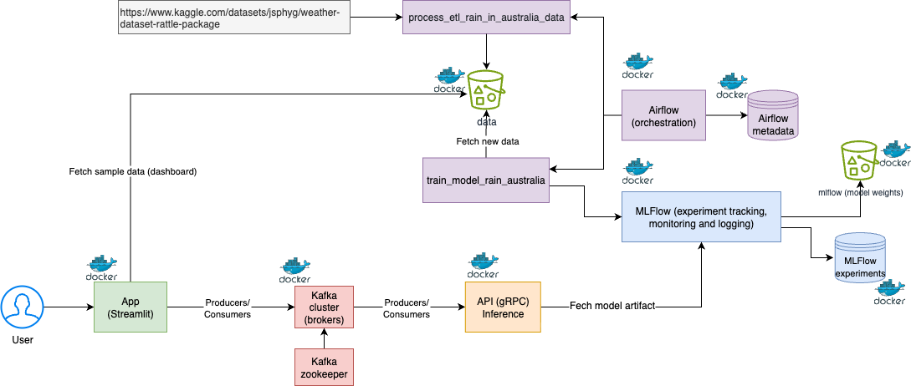
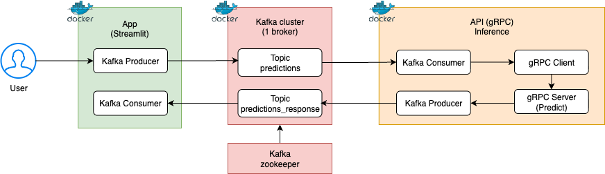

# Proyecto Final Aprendizaje de Máquina II - CEIA - FIUBA

### Integrantes:
- Kevin Cajachuán Arroyo
- Martín Paz
- Ariadna Garmendia


### Introducción
En este TP integrador de la materia Aprendizaje de Máquinas II implementamos el ciclo completo de MLOps, desde el preprocesamiento de los datos hasta el despliegue de un modelo de ML en producción.

El dataset utilizado es [Rain in Australia](https://www.kaggle.com/datasets/jsphyg/weather-dataset-rattle-package), el cual comprende aproximadamente 10 años de observaciones diarias del clima en numerosos lugares de Australia. El objetivo es predecir si lloverá o no al día siguiente en función de datos meteorológicos del día actual.

La implementación incluye:

- En Apache Airflow, un DAG que obtiene los datos del repositorio, realiza limpieza y
feature engineering, y guarda en el bucket `s3://data` los datos separados para entrenamiento
y pruebas. MLflow hace seguimiento de este procesamiento.
- Una notebook para ejecutar localmente con Optuna, que realiza una búsqueda de
hiperparámetros y encuentra el mejor modelo utilizando F1-score. Todo el experimento se
registra en MLflow, se generan gráficos de importancia de características, y además, se
registra el modelo en el registro de modelos de MLflow.
- Un servicio de API del modelo, que toma el artefacto de MLflow y lo expone para realizar
predicciones.
- En Apache Airflow, un DAG que, dado un nuevo conjunto de datos, reentrena el modelo. Se
compara este modelo con el mejor modelo (llamado `champion`), y si es mejor, se reemplaza. Todo
se lleva a cabo siendo registrado en MLflow.
- Una web app basada en Streamlit para interactuar fácilmente con el modelo.
- Un subsistema de predicción en tiempo real que utiliza Kafka y una API gRPC para manejar pedidos de
predicción desde la web app y devolver los resultados.





### Pasos para probar el proyecto
- Clonar el [repositorio](https://github.com/Kajachuan/AMq2), utilizar el branch `main`
- En Linux o MacOS: sustituir en el archivo `.env` el `AIRFLOW_UID` por el ID de usuario correspondiente (`id -u <nombre_usuario>`)
- Ejecutar `docker compose` en el directorio raíz del repositorio: `docker compose --profile all up`
- En **Airflow** se verán dos DAGS:
    * `process_etl_rain_in_australia_data`
    * `retrain_the_model`
- Ejecutar el DAG `process_etl_rain_in_australia_data`, de esta manera se crearán los datos en el bucket `s3://data`
- Una vez finalizado, ejecutar la notebook `experiment_mlflow.ipynb`
- Opcionalmente, ejecutar el DAG `retrain_the_model`
- Verificar en **MLFlow** la creación del experimento y del modelo registrado
- Verificar los datos generados en MinIO
- Para probar el modelo:
    * Ejecutar la notebook `fastapi.ipynb` o
    * Ingresar al web server de **Streamlit**
        * En la página *Dashboard*, en la pestaña *Predicciones*, ingresar los datos y hacer una predicción de lluvia
- Para detener `docker compose` y eliminar todas las imágenes: `docker compose down --rmi all --volumes`


### URLs de los servicios
- Apache Airflow: http://localhost:8080
- MLflow: http://localhost:5000
- MinIO: http://localhost:9001
- FastAPI: http://localhost:8800/
- Documentación de la API: http://localhost:8800/docs
- Streamlit: http://localhost:8501/

Para verificar el estado de los servicios ejecutar `docker -ps a`:

```
CONTAINER ID   IMAGE                             COMMAND                  CREATED        STATUS                    PORTS                                            NAMES
04a43f467842   grpc_service                      "python main.py"         21 hours ago   Up 21 hours (healthy)     0.0.0.0:50051->50051/tcp                         grpc_service
5c668922b064   streamlit_app                     "streamlit run home.…"   22 hours ago   Up 22 hours (unhealthy)   0.0.0.0:8501->8501/tcp                           streamlit_app
19837641b638   backend_fastapi                   "uvicorn app:app --h…"   42 hours ago   Up 42 hours (healthy)     0.0.0.0:8800->8800/tcp                           fastapi
d1ec16e20a96   extending_airflow:latest          "/usr/bin/dumb-init …"   42 hours ago   Up 42 hours (healthy)     0.0.0.0:8080->8080/tcp                           airflow_webserver
f6f0208f2291   extending_airflow:latest          "/usr/bin/dumb-init …"   42 hours ago   Up 42 hours (healthy)     8080/tcp                                         airflow_scheduler
2c4fa585fc51   backend_graphql                   "uvicorn app_graphql…"   42 hours ago   Up 42 hours (unhealthy)   0.0.0.0:8801->8801/tcp                           graphql
bd1016fba8e0   confluentinc/cp-kafka:7.0.1       "/etc/confluent/dock…"   42 hours ago   Up 42 hours (healthy)     0.0.0.0:9092->9092/tcp, 0.0.0.0:9094->9094/tcp   kafka
89636189e8d4   mlflow                            "mlflow server --bac…"   42 hours ago   Up 42 hours (healthy)     0.0.0.0:5001->5000/tcp                           mlflow
f194bfca7700   minio/minio:latest                "/usr/bin/docker-ent…"   42 hours ago   Up 42 hours (healthy)     0.0.0.0:9000-9001->9000-9001/tcp                 minio
47ec7753f940   postgres_system                   "docker-entrypoint.s…"   42 hours ago   Up 42 hours (healthy)     0.0.0.0:5432->5432/tcp                           postgres
11a11bfa373a   confluentinc/cp-zookeeper:7.0.1   "/etc/confluent/dock…"   42 hours ago   Up 42 hours (healthy)     2888/tcp, 0.0.0.0:2181->2181/tcp, 3888/tcp       zookeeper
```


### Descripción de los DAGs
1. `process_etl_rain_in_australia_data` (`dags/etl_process.py`)
    - Este DAG gestiona la carga de datos, transformaciones, división del conjunto de datos entrenamiento y validación, y la normalización de los datos.
    - Se ejecuta el primer día de cada mes a las 00:00 horas.

2. `train_model_rain_australia` (`dags/retrain_model.py`)
    - Este DAG realiza el reentrenamiento del modelo basado en uno previamente cargado en MLflow. Si las métricas del nuevo modelo superan las del modelo existente, este se actualiza, se etiqueta como "champion" y se desmarca el anterior.
    - Se ejecuta el primer día de cada mes a la 02:00 horas, dos horas después del otro DAG.

### Detalles de configuración subsistema de predicción (Streamlit + Kafka + gRPC)



**Componentes:**
- **Streamlit Container** (Aplicación)
  - Producer: Envía pedidos de predicción a Kafka
  - Consumer: Recibe respuestas (predicciones) desde Kafka

- **Kafka Cluster**
  - Tópico: `predictions` -> para pedidos de predicciones
  - Tópico: `predictions-response` -> para resultados de predicciones
  - Zookeeper: coordinación del cluster Kafka

- **Servicio de Inferencia (API gRPC Inference Service)** 
  - Kafka Consumer: Lee pedidos de predicciones (tópico predictions)
  - gRPC Client: Crea el stub y llama al gRPC server
  - gRPC Server: Ejecuta la inferencia con el modelo de ML
  - Kafka Producer: Envía los resultados al tópico de respuestas (predictions-response)

### Diagrama de sequencia de un pedido de predicción

[](https://mermaid.live/edit#pako:eNqNVNuO0zAQ_ZWRHxBI3ZBecqmFKq26SFy0sNrCC6qEjDNtzSZ21nEqlqpfxSfwY4wTElq6ReRlfJlzfOZ44h2TJkPGWYX3NWqJV0qsrSiWGugrhXVKqlJoBx8rtCCqJp7uLpxFUeTK-ZQ_k8uyPM19K1Z34hbvfWozfvHFPp-VFjMlnTK6AmdKJU-B69ubuQc1cYF2qySepa_Ks_wXlnYpEriF-5ouZrNeN4dhAK_1mvKEhUw4U0GGOchcFQKe-CjvYMluiBOlskvW8vQEx2RzGlmoNVhvcuVAGn0w_ayyU3hnEodRAC_1VhEDKSipiMyQGGjrkernDw1P3yzev3vWknRA4vA-cRgHMKdi60KdZ2ihPr-HTQL4YIWuVsYWdHYuALWzIhMgcmgWnQHSD-QlWuGpC2ql3DzCFVEJX1HWriU6lO6t-Bc0DuCyE-CvzRsmOtTfBv5G9h3AIenNO8IfGvaI6x6ZBvBKSGzurTR57ntMwJYWKgUb8UDr_6GoJzzuiGkAV7g1uac7FHaqyLcmtWMYwLWpyH_bnlLVuRPtNR4bygZsbVXGuLM1DliBZJ6fsp3nXjK3wQKXjNMww5UgGt-8e4LRz_PJmKJDWlOvN4yvRF7RrC7pL-gehz4FdYZ2bmrtGE8bBsZ37BvjyXgSpNMoGcZJOAmTJBqwB8ZHkyRIxkkUj5PhJIxHYbofsO_NmWEQDadxlI7CJJ2OaT8eMKrJGXvdvk_NM7X_BXI2kcs)

### Pruebas con distintas APIs
Durante el desarrollo del proyecto se probaron distintas APIs para la comunicación entre la aplicación de Streamlit y el servicio de inferencia. Se optó por gRPC debido a su eficiencia y rendimiento en comparación con REST y GraphQL. Los resultados del análisis comparativo se encuentran en la siguiente [notebook](notebooks/clients_comparison.ipynb).